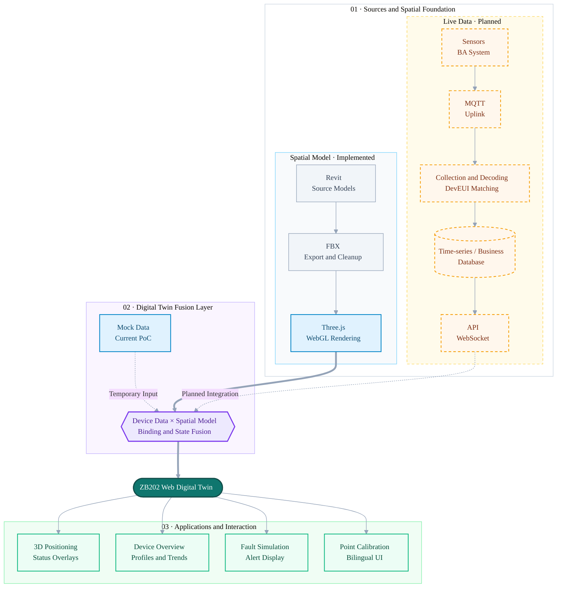

# ZB202 Web Digital Twin

[中文](README.md) | [English](README.en.md)

A web digital twin proof of concept for monitoring laboratory equipment in ZB202. Built with Vite, Three.js, and FBX, it combines a room model with spatial device positioning, simulated live telemetry, fault states, and device records.

> This is currently a frontend PoC. All device data is mocked; no live MQTT, database, or backend API is connected yet.

Live demo: [https://lyuml.github.io/ZB202_DT/](https://lyuml.github.io/ZB202_DT/)

## Highlights

- Loads `ZN1001v2.fbx`, displays 145 physical components, and filters 61 helper centerlines.
- Supports orbit, pan, zoom, view reset, and model-loading feedback.
- Binds devices through BIM component IDs or spatial coordinates.
- Displays device metrics, trends, timestamps, simulated faults, and status recovery.
- Uses an immersive full-page 3D workspace with a device panel that slides in from the right.
- Supports Chinese and English; the room view inherits the language selected on the overview page.
- Includes device overview, device detail, and point-coordinate calibration tools.

## Current Solution Assessment

### 1. Technical Path

The current implementation follows a lightweight web digital-twin PoC path. Revit/FBX provides the spatial model, Vite builds the frontend, and Three.js/WebGL renders it in the browser. Devices are associated with the model through BIM component IDs or world coordinates. Device lists, metrics, trends, and fault states are currently driven by frontend mock data.

The planned production data path is: sensors or the BA system publish through MQTT; backend services collect messages, match DevEUIs, decode payloads, and store live values, history, and alerts; HTTP APIs or WebSockets then deliver the data to the frontend. The frontend handles 3D positioning, status overlays, and interaction rather than connecting directly to the MQTT broker.



Blue nodes represent the main parts already implemented in the PoC. Orange dashed nodes represent the planned live-data integration path.

This path is well suited to validating the value of equipment monitoring, spatial positioning, and fault visualization first. If web loading performance becomes the priority, FBX should be preprocessed into GLB/glTF. If complete BIM properties and component-query capabilities are required, an IFC/Web BIM path should be evaluated further.

### 2. Advantages

- **Fast PoC delivery**: the small stack avoids a Unity deployment or a full BIM platform, and the static build can be demonstrated through GitHub Pages.
- **Low access barrier**: no client installation is required; a desktop browser is enough for reviews, sharing, and iteration.
- **Relative separation of model and business data**: the 3D model provides spatial context while device data is organized by `deviceId`, DevEUI, and binding metadata, allowing mock data to be replaced without rebuilding the scene.
- **Flexible positioning**: BIM component IDs and spatial coordinates cover both modeled assets and sensors that do not exist as BIM components.
- **A testable interaction loop already exists**: the room view, overview, detail page, bilingual UI, fault simulation, and point calibration form a complete demonstration flow.

### 3. Challenges and Limitations

- **No live digital-twin loop yet**: values, trends, and alerts are mocked. The MQTT collector, decoding, database, API/WebSocket layer, reconnection handling, and data-freshness monitoring remain to be implemented.
- **FBX is not an ideal long-term web delivery format**: file size, loading speed, material optimization, and progressive loading are limited, and performance risk rises as the model grows.
- **Limited BIM semantics**: FBX does not reliably preserve Revit properties, system relationships, or stable component identities. Bindings based on object names or manual coordinates can break after a model re-export.
- **No formal model pipeline**: RVT/FBX cleaning, coordinate alignment, optimization, versioning, and binding regression checks are not standardized, so model updates may move points or change component IDs.
- **The frontend architecture remains PoC-level**: device data and some UI logic are duplicated, with no unified state layer, API contract validation, automated tests, access control, or observability. Maintenance cost will rise with scope.
- **Runtime constraints**: Three.js depends on WebGL and client GPU capacity. Low-end hardware, larger models, or many live labels may cause slow initial loads, frame drops, and high memory use.
- **Production security is not covered**: broker credentials, API authentication, device authorization, auditing, data retention, and alert acknowledgement are outside the current implementation. Downlink control is not ready to be enabled safely.

## Quick Start

### Requirements

- Node.js `20.19+` or `22.12+`
- npm

### Development

```powershell
npm install
npm run dev
```

Open [http://localhost:5173/](http://localhost:5173/). The root URL redirects to the room model.

### Production Build

```powershell
npm run build
npm run preview
```

The preview is normally available at [http://localhost:4173/](http://localhost:4173/). Production files are written to `dist/`. Only the FBX referenced by the application is bundled; RVT files, device backups, and internal documentation are excluded.

### GitHub Pages Deployment

Every push to `main` triggers GitHub Actions to run `npm ci` and `npm run build` with Node.js 24, then publish `dist/` to GitHub Pages. The generated `dist/` directory is not committed.

## Pages

| Page | URL | Purpose |
| --- | --- | --- |
| Room View | `/twin.html` | Three.js model, device positioning, live status, and fault demo |
| Device Overview | `/overview.html` | Card and table views for nine registered devices |
| Device Detail | `/device.html?deviceId=AM103_07` | Profile and metrics for one device |

The language is controlled by `?lang=zh` or `?lang=en` and stored in the browser. The overview page passes its active language to the room view.

## Room View Controls

- Left-drag: rotate the model.
- Right-drag: pan the view.
- Mouse wheel: zoom.
- **Device Panel**: opens live device information from the right; the model shifts left while the panel is visible.
- **Calibrate Point**: picks world coordinates on the model surface for sensors that are not modeled as BIM components.
- **Reset View**: restores the default camera view.

## Model and Device Binding

The web application currently loads one model:

| Model | Physical Components | Purpose |
| --- | ---: | --- |
| `models/fbx/ZN1001v2.fbx` | 145 | Original export used by the room view |

Two binding approaches are demonstrated:

1. **BIM component binding**: locates the fan coil unit through its FBX object name and Revit ID `[738100]`.
2. **Spatial coordinate binding**: places the `AM103-DEMO` marker at a world-space coordinate.

`models/fbx/ZN1001v2-3dnew.fbx` is retained as a source asset but is not included in the current web build. `models/rvt/` contains the Revit source models; browsers do not load RVT files directly.

## Project Structure

```text
ZB202_DT/
├── web/
│   ├── index.html              # Root entry
│   ├── overview.html           # Device overview
│   ├── device.html             # Device detail
│   ├── twin.html               # Immersive room view
│   └── src/
│       ├── app.js              # Overview, detail, and language logic
│       ├── twin.js             # Three.js scene and device interactions
│       ├── styles.css          # Shared styles
│       └── data/devices.js     # Mock device data
├── models/
│   ├── fbx/                    # Web model and retained FBX source asset
│   └── rvt/                    # Revit source models
├── dvc/                        # CSV/XLSX device-list backups
├── docs/
│   ├── architecture/           # Technical routes
│   └── integrations/           # MQTT integration notes
├── package.json
├── vite.config.js
├── README.md
└── README.en.md
```

## Data Integration Path

`dvc/` contains the names, models, types, DevEUIs, profiles, and payload decoders for nine devices. A live integration should use DevEUI to map MQTT uplinks to device records.

```text
Milesight sensors / BA system
→ MQTT uplink collector
→ payload decoder + DevEUI matching
→ InfluxDB / database
→ HTTP API or WebSocket
→ Web Digital Twin
```

The frontend should not connect directly to MQTT. The planned backend endpoints are:

```text
GET /api/devices
GET /api/latest
GET /api/history?deviceId=AM103_07&metric=temperature&range=24h
GET /api/alerts
```

MQTT connection and topic notes are stored in `docs/integrations/mqtt-interface-notes.txt`.

## Current Limitations and Next Step

- Live values, trends, statuses, and alerts are mocked.
- The FBX and ZB202 Revit source models do not yet have a formal conversion or versioning pipeline.
- Device coordinates still require calibration against the physical room or Revit model.
- The MQTT collector, payload decoder, database, and backend API are not implemented.
- Device downlink control is not available.

The recommended next step is to capture real MQTT uplink samples for each device model, build DevEUI matching and decoding services, and expose the resulting data through a consistent API or WebSocket interface.
