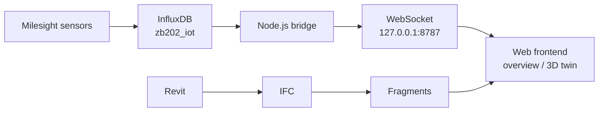

# ZB202 Web Digital Twin

[中文](README.md) | [English](README.en.md)

A digital twin for environmental monitoring in laboratory ZB202. The frontend uses Vite, Three.js, and That Open Fragments to display BIM models, while a local bridge reads sensor data from InfluxDB.

## Data path


```mermaid
flowchart LR
  SENSOR["Milesight sensors"] --> DB["InfluxDB<br/>zb202_iot"]
  DB --> BRIDGE["Node.js bridge"]
  BRIDGE --> WS["WebSocket<br/>127.0.0.1:8787"]
  WS --> WEB["Web frontend<br/>overview / 3D twin"]

  RVT["Revit"] --> IFC["IFC"]
  IFC --> FRAG["Fragments"]
  FRAG --> WEB
```

InfluxDB connection:

```text
URL:    http://influxdb.itf.beeerise.com
Org:    PolyU
Bucket: zb202_iot
```

The browser does not connect to InfluxDB directly. The API token is read only by the local bridge and is not bundled into frontend assets.

## Usage

### 1. Install dependencies

Install Node.js 20.19 or newer, then run:

```powershell
npm install
```

### 2. Configure InfluxDB

Create a local environment file:

```powershell
Copy-Item .env.example .env
```

Add the real token to `.env`:

```dotenv
ZB202_INFLUX_URL=http://influxdb.itf.beeerise.com
ZB202_INFLUX_TOKEN=your-token
ZB202_INFLUX_ORG=PolyU
ZB202_INFLUX_BUCKET=zb202_iot
```

`.env` is ignored by Git. Never commit a real token.

### 3. Start the project

On Windows, double-click:

```text
start-zb202.bat
```

Or run the services in separate terminals:

```powershell
npm run influx:bridge
```

```powershell
npm run dev -- --host 127.0.0.1
```

Open:

- Overview: `http://127.0.0.1:5173/overview.html`
- 3D twin: `http://127.0.0.1:5173/twin.html`

Test the data bridge:

```powershell
npm run test:bridge
```

Build production assets:

```powershell
npm run build
```

## Project structure

```text
ZB202_DT/
├── docs/                         # Architecture and quality notes
├── dvc/                          # Device-list backups
├── models/
│   ├── ifc/                      # IFC source models
│   └── rvt/                      # Revit source models
├── scripts/
│   ├── influxdb-bridge.mjs       # InfluxDB-to-WebSocket bridge
│   ├── bridge-smoke-test.mjs     # Data-path smoke test
│   └── ifc-to-fragments.mjs      # IFC-to-Fragments conversion
├── web/
│   ├── public/models/fragments/  # Browser runtime models
│   ├── src/dashboard/            # Overview page
│   ├── src/shared/               # Shared styles and themes
│   ├── src/twin/                 # 3D twin page
│   ├── overview.html
│   ├── device.html
│   └── twin.html
├── .env.example                  # InfluxDB configuration template
├── package.json                  # npm commands and dependencies
├── start-zb202.bat               # Windows launcher
└── vite.config.js                # Vite build configuration
```

`node_modules/`, `dist/`, `.cache/`, and `.env` are local generated content and are not committed to Git.
