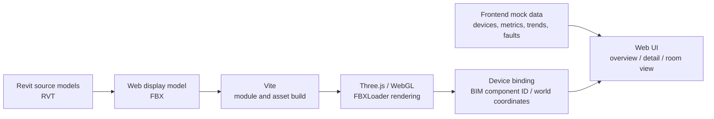
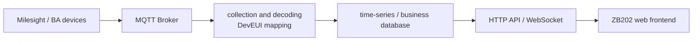

# ZB202 Web Digital Twin

[中文](README.md) | [English](README.en.md)

**Live demo: [Open ZB202 Web Digital Twin](https://lyuml.github.io/ZB202_DT/)**

A lightweight web digital-twin PoC for equipment monitoring in laboratory ZB202. The current implementation follows Route A: a Vite multi-page frontend with Three.js/WebGL and an FBX room model.

## Technical Path

### Current Implementation


```mermaid
flowchart LR
  RVT["Revit source models<br/>RVT"] --> FBX["Web display model<br/>FBX"]
  FBX --> VITE["Vite<br/>module and asset build"]
  VITE --> THREE["Three.js / WebGL<br/>FBXLoader rendering"]
  MOCK["Frontend mock data<br/>devices, metrics, trends, faults"] --> UI["Web UI<br/>overview / detail / room view"]
  THREE --> BIND["Device binding<br/>BIM component ID / world coordinates"]
  BIND --> UI
```

- **Model path**: `models/rvt/` stores the Revit source files. Vite imports `models/fbx/ZN1001v2.fbx` through `?url`, and Three.js renders it with `FBXLoader`.
- **Device binding**: existing BIM elements use component IDs; sensors without model elements use world-coordinate markers.
- **Data status**: device records, trends, alarms, and fault simulation currently use frontend mock data. A live MQTT connection is not implemented.
- **Pages**: `overview.html` provides the device directory and global language/theme controls; `device.html` shows one device; `twin.html` provides the 3D room and device panel.

### Planned Live-data Path


```mermaid
flowchart LR
  DEVICE["Milesight / BA devices"] --> MQTT["MQTT Broker"]
  MQTT --> COLLECTOR["collection and decoding<br/>DevEUI mapping"]
  COLLECTOR --> DB["time-series / business database"]
  DB --> API["HTTP API / WebSocket"]
  API --> WEB["ZB202 web frontend"]
```

This path is planned for the next phase. The frontend will not connect directly to MQTT. A collector will decode payloads, map devices, and write data; the frontend will consume business data through an API or WebSocket.

## Folder Structure

```text
ZB202_DT/
├── .github/
│   └── workflows/
│       └── deploy-pages.yml       # GitHub Pages build and deployment
├── docs/
│   ├── architecture/
│   │   └── technical-routes.mmd   # Technical-route comparison
│   ├── integrations/
│   │   └── mqtt-interface-notes.txt
│   └── quality/
│       └── design-qa.md           # Archived design QA
├── dvc/
│   ├── zb202_device_backup.csv    # Master device-list backup
│   └── zb202_device_backup.xlsx
├── models/
│   ├── fbx/                       # Web-ready models
│   │   ├── ZN1001v2.fbx
│   │   └── ZN1001v2-3dnew.fbx
│   └── rvt/                       # Revit source models
│       ├── Lab Architecture Model.rvt
│       └── Lab MEP Model.rvt
├── web/
│   ├── index.html                 # Root entry
│   ├── overview.html              # Device overview
│   ├── device.html                # Device detail
│   ├── twin.html                  # Three.js room view
│   └── src/
│       ├── dashboard/
│       │   ├── app.js             # Overview and detail behavior
│       │   └── devices.js         # Frontend device records
│       ├── shared/
│       │   ├── styles.css         # Shared layout and components
│       │   └── theme.css          # Global day/night theme
│       └── twin/
│           ├── app.js             # Three.js, FBX, and device interaction
│           └── styles.css         # Room-view styles
├── package.json                   # npm scripts and dependencies
├── package-lock.json              # Locked dependency versions
├── vite.config.js                 # Multi-page build configuration
├── start-zb202.bat                # One-click Windows launcher
├── README.md
└── README.en.md
```

`node_modules/` and `dist/` are local install/build outputs rather than source directories. Both are ignored by Git.
