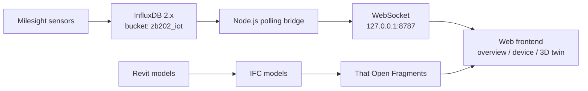

# ZB202 Web Digital Twin

[中文](README.md) | [English](README.en.md)

A browser-based digital twin for environmental monitoring in laboratory ZB202. It combines Vite, Three.js, and That Open Fragments for IFC/BIM visualization with a local bridge that reads time-series sensor data from InfluxDB.

> Live demo: [ZB202 Web Digital Twin](https://lyuml.github.io/ZB202_DT/)
>
> The hosted site contains the static frontend only. Live InfluxDB data requires the local bridge.

## Architecture


```mermaid
flowchart LR
  SENSOR["Milesight sensors"] --> INFLUX["InfluxDB 2.x<br/>bucket: zb202_iot"]
  INFLUX --> BRIDGE["Node.js polling bridge"]
  BRIDGE --> WS["WebSocket<br/>127.0.0.1:8787"]
  WS --> UI["Web frontend<br/>overview / device / 3D twin"]

  RVT["Revit models"] --> IFC["IFC models"]
  IFC --> FRAG["That Open Fragments"]
  FRAG --> UI
```

The browser never connects to InfluxDB directly. The API token is read only by the local Node.js bridge and is not bundled into frontend assets.

## Features

- Federated Architecture, MEP, and Sensor Fragments layers with independent visibility controls.
- BIM-to-device binding through IFC `GlobalId` values or world-coordinate markers.
- Temperature, relative-humidity, and CO₂ history from InfluxDB.
- DevEUI-based mapping between time-series rows and sensors.
- Live status and latest readings on both the overview and 3D twin pages through the local WebSocket.
- The most recent 24 trend points; a sensor is marked offline after 15 minutes without a new record.
- Light/dark themes and Chinese/English UI.
- Live BMS/AHU data, backend alarms, and AI analysis are not yet connected.

## Requirements

- Node.js 20.19 or newer
- npm
- A reachable InfluxDB 2.x instance
- An InfluxDB API token with read access to the target bucket

## InfluxDB schema

The default bucket is `zb202_iot`. The bridge recognizes these field aliases:

| UI metric | Supported InfluxDB `_field` values |
| --- | --- |
| Temperature | `temperature_c` (current), `temperature`, `temp` |
| Relative humidity | `relative_humidity_pct` (current), `humidity`, `relativeHumidity`, `rh` |
| CO₂ | `co2_ppm` (current), `co2`, `co2Concentration` |

The current bucket uses device IDs as measurements (for example, `AM103_05`), which the bridge maps directly to frontend device IDs. `devEui`, `deviceEui`, `dev_eui`, and `device_eui` tags remain supported.

No measurement filter is applied by default. Set `ZB202_INFLUX_MEASUREMENT` when the bucket contains unrelated measurements.

## Configuration

Create a local environment file:

```powershell
Copy-Item .env.example .env
```

Edit `.env`:

```dotenv
ZB202_INFLUX_URL=http://influxdb.itf.beeerise.com
ZB202_INFLUX_TOKEN=your-read-only-token
ZB202_INFLUX_ORG=PolyU
ZB202_INFLUX_BUCKET=zb202_iot

# Optional
ZB202_INFLUX_MEASUREMENT=
ZB202_INFLUX_DEVICE_COLUMN=devEui
ZB202_INFLUX_POLL_INTERVAL_MS=10000
ZB202_INFLUX_POLL_LOOKBACK=-15m
ZB202_INFLUX_HISTORY_RANGE=-24h
ZB202_INFLUX_BRIDGE_PORT=8787
```

`.env` is ignored by Git. Never place a real token in documentation, frontend code, or version control. A read-only production token is recommended.

## Running the project

### Windows launcher

After configuring `.env`, double-click `start-zb202.bat`. It installs missing dependencies, starts the InfluxDB bridge and Vite server, and opens the overview page.

### Manual startup

Install dependencies once:

```powershell
npm install
```

Run these commands in separate terminals:

```powershell
npm run influx:bridge
```

```powershell
npm run dev -- --host 127.0.0.1
```

Open:

- Overview: `http://127.0.0.1:5173/overview.html`
- Device detail: `http://127.0.0.1:5173/device.html`
- 3D twin: `http://127.0.0.1:5173/twin.html`

## Commands

| Command | Purpose |
| --- | --- |
| `npm run dev` | Start the Vite development server |
| `npm run influx:bridge` | Start the InfluxDB-to-WebSocket bridge |
| `npm run test:bridge` | Verify the bridge and all five ZB202 sensor streams |
| `npm run build` | Build production assets into `dist/` |
| `npm run preview` | Preview the production build |
| `npm run bim:convert` | Convert IFC models to Fragments |

## Project structure

```text
ZB202_DT/
├── docs/                         # Architecture and quality notes
├── dvc/                          # Device-list backups
├── models/
│   ├── ifc/                      # IFC source models
│   └── rvt/                      # Revit source models
├── scripts/
│   ├── influxdb-bridge.mjs       # InfluxDB query and WebSocket bridge
│   └── ifc-to-fragments.mjs      # IFC-to-Fragments conversion
├── web/
│   ├── public/models/fragments/  # Browser runtime models
│   ├── src/dashboard/            # Overview and device-detail logic
│   ├── src/shared/               # Shared styles and themes
│   ├── src/twin/                 # 3D twin logic and styles
│   ├── overview.html
│   ├── device.html
│   └── twin.html
├── .env.example                  # InfluxDB configuration template
├── package.json
├── start-zb202.bat               # Windows launcher
└── vite.config.js
```

`node_modules/`, `dist/`, `.cache/`, and `.env` are local generated content and are ignored by Git.

## Troubleshooting

### Missing environment variables

Make sure `.env` exists in the project root and defines `ZB202_INFLUX_URL`, `ZB202_INFLUX_TOKEN`, `ZB202_INFLUX_ORG`, and `ZB202_INFLUX_BUCKET`.

### InfluxDB connects but no readings appear

Check that:

1. The token can read `zb202_iot`.
2. The organization is `PolyU` and the optional measurement setting is correct.
3. Field names follow the schema above.
4. The DevEUI tag matches a device in `web/src/dashboard/devices.js`.
5. Timestamps fall inside `ZB202_INFLUX_HISTORY_RANGE`.

### Devices appear offline

The frontend marks sensors offline when the database bridge is unavailable or when no new reading has arrived for 15 minutes. Check the terminal running `npm run influx:bridge` first.

InfluxDB measurements use underscore IDs such as `AM103_05`, while frontend devices use hyphen IDs such as `AM103-05`; the application normalizes these formats automatically. Run the end-to-end bridge check with:

```powershell
npm run test:bridge
```

## Status and polling behavior

- On startup, the bridge reads the last 24 points per series inside `ZB202_INFLUX_HISTORY_RANGE`.
- During normal operation it polls every 10 seconds and looks back 15 minutes to catch delayed writes.
- A bounded deduplication cache prevents memory growth during long-running sessions.
- All sensors are marked offline when InfluxDB or the local bridge is unavailable.
- When the database is healthy, an individual sensor is marked offline only after 15 minutes without a new record.
