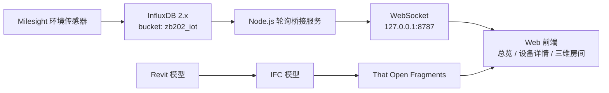

# ZB202 Web Digital Twin

[中文](README.md) | [English](README.en.md)

ZB202 实验室环境监测数字孪生系统。项目使用 Vite、Three.js 和 That Open Fragments 在浏览器中加载 IFC/BIM 模型，并通过本地桥接服务读取 InfluxDB 时序数据，在三维场景中展示传感器状态、最新读数和历史趋势。

> 在线演示：[ZB202 Web Digital Twin](https://lyuml.github.io/ZB202_DT/)
>
> 在线页面只能展示静态前端内容；实时 InfluxDB 数据需要在本地运行桥接服务。

## 系统架构



浏览器不会直接连接 InfluxDB。Token 只由本地 Node.js 桥接服务读取，不会被打包进前端，也不会发送给浏览器。

## 当前功能

- 加载 Architecture、MEP 和 Sensor Fragments 模型，并独立控制各图层可见性。
- 通过 IFC `GlobalId` 或世界坐标绑定 BIM 构件与传感器。
- 从 InfluxDB 读取温度、相对湿度和 CO₂ 数据。
- 按 DevEUI 将时序数据映射到对应传感器。
- 总览页和三维孪生页均通过本地 WebSocket 展示实时状态与最新读数。
- 展示最近 24 个数据点的趋势；设备超过 15 分钟无新记录时标记为离线。
- 支持日间/夜间主题和中英文界面。
- BMS/AHU 实时数据、告警后端和 AI 分析尚未接入。

## 环境要求

- Node.js 20.19 或更高版本
- npm
- 可访问的 InfluxDB 2.x 服务
- 具有目标 bucket 读取权限的 InfluxDB API Token

## InfluxDB 数据约定

默认 bucket 为 `zb202_iot`。桥接服务支持以下常见字段别名：

| 前端指标 | 支持的 InfluxDB `_field` |
| --- | --- |
| 温度 | `temperature_c`（当前）、`temperature`、`temp` |
| 相对湿度 | `relative_humidity_pct`（当前）、`humidity`、`relativeHumidity`、`rh` |
| CO₂ | `co2_ppm`（当前）、`co2`、`co2Concentration` |

当前 bucket 使用设备编号作为 measurement（如 `AM103_05`），桥接服务会直接映射到前端设备 ID；同时也兼容 `devEui`、`deviceEui`、`dev_eui` 和 `device_eui` tag。

measurement 默认不限制；如果 bucket 中包含多类数据，建议设置 `ZB202_INFLUX_MEASUREMENT`，避免扫描无关 measurement。

## 配置

复制配置模板：

```powershell
Copy-Item .env.example .env
```

编辑 `.env`：

```dotenv
ZB202_INFLUX_URL=http://influxdb.itf.beeerise.com
ZB202_INFLUX_TOKEN=your-read-only-token
ZB202_INFLUX_ORG=PolyU
ZB202_INFLUX_BUCKET=zb202_iot

# 可选
ZB202_INFLUX_MEASUREMENT=
ZB202_INFLUX_DEVICE_COLUMN=devEui
ZB202_INFLUX_POLL_INTERVAL_MS=10000
ZB202_INFLUX_POLL_LOOKBACK=-15m
ZB202_INFLUX_HISTORY_RANGE=-24h
ZB202_INFLUX_BRIDGE_PORT=8787
```

`.env` 已被 Git 忽略。请勿把真实 Token 写入 README、前端代码或提交到版本库；生产环境建议使用只读 Token。

## 启动

### Windows 一键启动

完成 `.env` 配置后，双击：

```text
start-zb202.bat
```

脚本会在缺少依赖时自动执行 `npm install`，随后启动 InfluxDB 桥接服务和 Vite 开发服务器，并打开设备总览页面。

### 手动启动

首次运行：

```powershell
npm install
```

分别打开两个终端：

```powershell
npm run influx:bridge
```

```powershell
npm run dev -- --host 127.0.0.1
```

访问：

- 设备总览：`http://127.0.0.1:5173/overview.html`
- 设备详情：`http://127.0.0.1:5173/device.html`
- 三维孪生：`http://127.0.0.1:5173/twin.html`

## 常用命令

| 命令 | 用途 |
| --- | --- |
| `npm run dev` | 启动 Vite 开发服务器 |
| `npm run influx:bridge` | 启动 InfluxDB → WebSocket 桥接服务 |
| `npm run test:bridge` | 验证桥接连接及五台 ZB202 传感器数据 |
| `npm run build` | 构建生产版本到 `dist/` |
| `npm run preview` | 本地预览生产构建 |
| `npm run bim:convert` | 将 IFC 模型转换为 Fragments |

## 项目结构

```text
ZB202_DT/
├── docs/                         # 架构与质量文档
├── dvc/                          # 设备清单备份
├── models/
│   ├── ifc/                      # IFC 源模型
│   └── rvt/                      # Revit 母模型
├── scripts/
│   ├── influxdb-bridge.mjs       # InfluxDB 查询与 WebSocket 桥接
│   └── ifc-to-fragments.mjs      # IFC 转 Fragments
├── web/
│   ├── public/models/fragments/  # 浏览器运行模型
│   ├── src/dashboard/            # 总览与设备详情逻辑
│   ├── src/shared/               # 共享样式与主题
│   ├── src/twin/                 # 三维孪生逻辑与样式
│   ├── overview.html
│   ├── device.html
│   └── twin.html
├── .env.example                  # InfluxDB 配置模板
├── package.json
├── start-zb202.bat               # Windows 一键启动
└── vite.config.js
```

`node_modules/`、`dist/`、`.cache/` 和 `.env` 均为本地生成内容，已被 Git 忽略。

## 排障

### 桥接服务提示缺少环境变量

确认项目根目录存在 `.env`，并至少填写：

- `ZB202_INFLUX_URL`
- `ZB202_INFLUX_TOKEN`
- `ZB202_INFLUX_ORG`
- `ZB202_INFLUX_BUCKET`

### InfluxDB 已连接但页面没有数据

依次确认：

1. Token 对 `zb202_iot` 具有读取权限。
2. `.env` 中的 organization 为 `PolyU`，可选 measurement 配置正确。
3. 数据字段名称符合上面的字段约定。
4. DevEUI 存储在 tag 中，且能与 `web/src/dashboard/devices.js` 中的设备对应。
5. 数据时间戳位于 `ZB202_INFLUX_HISTORY_RANGE` 指定的范围内。

### 页面显示设备离线

桥接服务无法连接数据库，或者对应设备超过 15 分钟没有新数据时，前端会将设备标记为离线。请先查看运行 `npm run influx:bridge` 的终端输出。

InfluxDB measurement 使用下划线 ID（如 `AM103_05`），前端设备使用连字符 ID（如 `AM103-05`）；项目会自动归一化这两种格式。可运行以下命令进行端到端桥接检查：

```powershell
npm run test:bridge
```

## 状态与轮询逻辑

- 桥接服务启动时读取 `ZB202_INFLUX_HISTORY_RANGE` 范围内每个时序表最后 24 条记录。
- 正常运行时每 10 秒轮询一次，并回看最近 15 分钟，以避免遗漏延迟写入的数据。
- 重复记录通过有界缓存过滤，防止长期运行时内存持续增长。
- InfluxDB 或桥接服务断开时，页面将设备标记为离线。
- 数据库正常时，单台设备最后记录超过 15 分钟才标记为离线。
