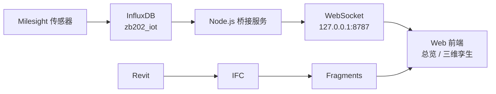

# ZB202 Web Digital Twin

[中文](README.md) | [English](README.en.md)

ZB202 实验室环境监测数字孪生项目。前端使用 Vite、Three.js 和 That Open Fragments 展示 BIM 模型，并通过本地桥接服务读取 InfluxDB 中的传感器数据。

## 项目路径



InfluxDB 连接信息：

```text
URL:    http://influxdb.itf.beeerise.com
Org:    PolyU
Bucket: zb202_iot
```

浏览器不直接连接 InfluxDB。Token 只由本地桥接服务读取，不会打包进前端。

## 如何使用

### 1. 准备环境

安装 Node.js 20.19 或更高版本，然后在项目根目录安装依赖：

```powershell
npm install
```

### 2. 配置 InfluxDB

复制配置模板：

```powershell
Copy-Item .env.example .env
```

在 `.env` 中填写真实 Token：

```dotenv
ZB202_INFLUX_URL=http://influxdb.itf.beeerise.com
ZB202_INFLUX_TOKEN=your-token
ZB202_INFLUX_ORG=PolyU
ZB202_INFLUX_BUCKET=zb202_iot
```

`.env` 已被 Git 忽略，请勿把真实 Token 写入代码或提交到仓库。

### 3. 启动项目

Windows 用户可直接双击：

```text
start-zb202.bat
```

macOS 可双击项目根目录下的 `start-zb202.command`。首次运行若被系统拦截，请在 Finder 中右键该文件并选择“打开”。

也可以分别打开两个终端手动运行：

```powershell
npm run influx:bridge
```

```powershell
npm run dev -- --host 127.0.0.1
```

访问页面：

- 总览：`http://127.0.0.1:5173/overview.html`
- 三维孪生：`http://127.0.0.1:5173/twin.html`

验证数据桥接：

```powershell
npm run test:bridge
```

构建生产版本：

```powershell
npm run build
```

### 校园网访问

先在服务器或本机的 `.env` 中设置：

```dotenv
ZB202_INFLUX_BRIDGE_HOST=0.0.0.0
```

然后分别启动实时桥接和静态网页服务：

```powershell
npm run build
npm run influx:bridge
npm run serve:lan
```

同一校园网内的设备访问：

```text
http://服务器校园网IP:8080/overview.html
http://服务器校园网IP:8080/twin.html
```

如果使用 Windows 防火墙，需要开放 TCP 端口 `8080` 和 `8787`。部署时 `.env` 中只放服务器本地的 InfluxDB Token，不要提交到 Git。

## 项目结构

```text
ZB202_DT/
├── docs/                         # 架构与质量文档
├── dvc/                          # 设备清单备份
├── models/
│   ├── ifc/                      # IFC 源模型
│   └── rvt/                      # Revit 源模型
├── scripts/
│   ├── influxdb-bridge.mjs       # InfluxDB → WebSocket 桥接
│   ├── bridge-smoke-test.mjs     # 数据链路测试
│   └── ifc-to-fragments.mjs      # IFC 转 Fragments
├── web/
│   ├── public/models/fragments/  # 浏览器运行模型
│   ├── src/dashboard/            # 总览页面
│   ├── src/shared/               # 共享样式与主题
│   ├── src/twin/                 # 三维孪生页面
│   ├── overview.html
│   ├── device.html
│   └── twin.html
├── .env.example                  # InfluxDB 配置模板
├── package.json                  # npm 命令与依赖
├── start-zb202.bat               # Windows 一键启动
├── start-zb202.command           # macOS 双击启动
└── vite.config.js                # Vite 构建配置
```

`node_modules/`、`dist/`、`.cache/` 和 `.env` 是本地生成内容，不提交到 Git。
