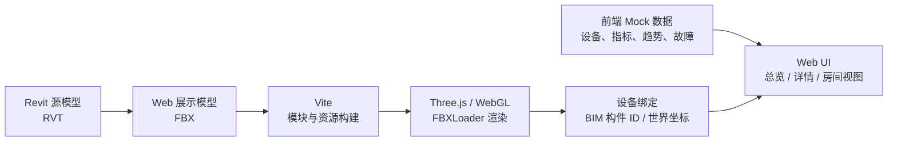
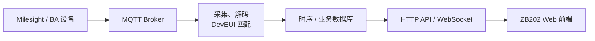

# ZB202 Web Digital Twin

[中文](README.md) | [English](README.en.md)

**在线演示：[打开 ZB202 Web Digital Twin](https://lyuml.github.io/ZB202_DT/)**

ZB202 实验室设备监控的轻量 Web 数字孪生 PoC，采用 Vite 多页面前端 + Three.js/WebGL + FBX 房间模型。

## 技术路径

### 当前实现



- **模型链路**：`models/rvt/` 保存 Revit 母文件；当前网页通过 Vite 的 `?url` 导入 `models/fbx/ZN1001v2.fbx`，再由 Three.js `FBXLoader` 渲染。
- **设备绑定**：已有 BIM 构件使用构件 ID；未建模传感器使用世界坐标 marker。
- **数据状态**：设备清单、趋势、告警和故障模拟目前均来自前端 Mock 数据，不代表真实 MQTT 已接通。
- **页面形态**：`overview.html` 管理设备总览与全局语言/主题；`device.html` 展示单台设备；`twin.html` 展示 3D 房间与设备面板。

### 计划中的真实数据链路



该链路仍是下一阶段计划。前端不会直接连接 MQTT；采集服务负责解码、设备映射与入库，前端只通过 API 或 WebSocket 读取业务数据。

## 文件夹结构

```text
ZB202_DT/
├── .github/
│   └── workflows/
│       └── deploy-pages.yml       # GitHub Pages 构建与部署
├── docs/
│   ├── architecture/
│   │   └── technical-routes.mmd   # 技术路线比较图
│   ├── integrations/
│   │   └── mqtt-interface-notes.txt
│   └── quality/
│       └── design-qa.md           # 设计 QA 归档
├── dvc/
│   ├── zb202_device_backup.csv    # 设备母表备份
│   └── zb202_device_backup.xlsx
├── models/
│   ├── fbx/                       # Web 可用模型
│   │   ├── ZN1001v2.fbx
│   │   └── ZN1001v2-3dnew.fbx
│   └── rvt/                       # Revit 母模型
│       ├── Lab Architecture Model.rvt
│       └── Lab MEP Model.rvt
├── web/
│   ├── index.html                 # 根入口
│   ├── overview.html              # 设备总览
│   ├── device.html                # 设备详情
│   ├── twin.html                  # Three.js 房间视图
│   └── src/
│       ├── dashboard/
│       │   ├── app.js             # 总览与详情逻辑
│       │   └── devices.js         # 前端设备数据
│       ├── shared/
│       │   ├── styles.css         # 共享布局与组件样式
│       │   └── theme.css          # 全局日间/夜间主题
│       └── twin/
│           ├── app.js             # Three.js、FBX 与设备交互
│           └── styles.css         # 房间视图样式
├── package.json                   # npm 脚本与依赖
├── package-lock.json              # 锁定依赖版本
├── vite.config.js                 # 多页面构建配置
├── start-zb202.bat                # Windows 一键启动
├── README.md
└── README.en.md
```

`node_modules/` 和 `dist/` 是本地安装／构建产物，不属于源码结构；它们已被 Git 忽略。
