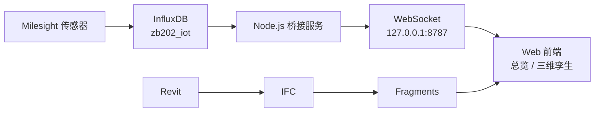

# ZB202 Web Digital Twin

## 人数与 CO₂ 预测控制实验原型

访问 `experiment.html` 可运行独立的研究仿真页面。它使用 0–10 人的可复现模拟场景、由另 120 个模拟训练日估计的时变马尔可夫链、单区 CO₂ 质量守恒模型，以及每 5 分钟滚动的通风优化建议。页面比较固定通风、按当前人数响应和预测控制，并可导出逐步 CSV。运行 `npm run test:experiment` 验证模型，运行 `npm run experiment:results` 生成 20 个场景的汇总和代表日 CSV；假设及局限见 [实验说明](docs/experiment/README.md)。
可直接在 Chrome 中打开 `web/experiment.html`。修改实验脚本后运行 `npm run experiment:browser` 更新供本地文件使用的脚本；`npm run build` 会自动更新并复制该脚本到部署目录。

所有风量均为**暂定的有效室外空气流量**，不是 ZB202 的 VAV 或 AHU 实测值。这个原型不会向现场 BMS 发送控制命令。真实 CO₂ 可从本地桥接服务手动选作初始状态；实验中的人员轨迹和后续 CO₂ 仍是模拟结果。

[中文](README.md) | [English](README.en.md)

ZB202 实验室环境监测数字孪生项目。前端使用 Vite、Three.js 和 That Open Fragments 展示 BIM 模型，并通过本地桥接服务读取 InfluxDB 中的传感器数据。

## 项目路径


```mermaid
flowchart LR
  SENSOR["Milesight 传感器"] --> DB["InfluxDB<br/>zb202_iot"]
  DB --> BRIDGE["Node.js 桥接服务"]
  BRIDGE --> WS["WebSocket<br/>127.0.0.1:8787"]
  WS --> WEB["Web 前端<br/>总览 / 三维孪生"]

  RVT["Revit"] --> IFC["IFC"]
  IFC --> FRAG["Fragments"]
  FRAG --> WEB
```

InfluxDB 连接信息：

```text
URL:    http://influxdb.itf.beeerise.com
Org:    PolyU
Bucket: zb202_iot
```

浏览器不直接连接 InfluxDB。Token 只由本地桥接服务读取，不会打包进前端。

## 如何使用

### 1. 准备环境

安装 Node.js 20.19 或更高版本，然后在项目根目录安装依赖：

```powershell
npm install
```

### 2. 配置 InfluxDB

复制配置模板：

```powershell
Copy-Item .env.example .env
```

在 `.env` 中填写真实 Token：

```dotenv
ZB202_INFLUX_URL=http://influxdb.itf.beeerise.com
ZB202_INFLUX_TOKEN=your-token
ZB202_INFLUX_ORG=PolyU
ZB202_INFLUX_BUCKET=zb202_iot
```

如果气象站数据位于独立的 InfluxDB bucket，可追加：

```dotenv
ZB202_WEATHER_INFLUX_BUCKET=weather_bucket_name
ZB202_WEATHER_INFLUX_MEASUREMENT=weather_measurement_name
ZB202_WEATHER_INFLUX_TOKEN=weather_bucket_token
```

气象数据沿用同一 URL 和组织；独立 Token 可填入 `ZB202_WEATHER_INFLUX_TOKEN`，留空时沿用主 Token。measurement 留空时会自动匹配名称中包含 `weather`、`outdoor`、`meteorological`、`aws` 或 `wx` 的数据。

`.env` 已被 Git 忽略，请勿把真实 Token 写入代码或提交到仓库。

### 3. 启动项目

Windows 用户可直接双击：

```text
start-zb202.bat
```

macOS 可双击项目根目录下的 `start-zb202.command`。首次运行若被系统拦截，请在 Finder 中右键该文件并选择“打开”。

也可以直接运行统一启动命令；它会自动启动 InfluxDB bridge 和 Vite，并在退出时关闭由它启动的 bridge：

```powershell
npm run dev -- --host 127.0.0.1
```

如需单独排查 bridge，仍可运行：

```powershell
npm run influx:bridge
```

访问页面：

- 总览：`http://127.0.0.1:5173/overview.html`
- 三维孪生：`http://127.0.0.1:5173/twin.html`

验证数据桥接：

```powershell
npm run test:bridge
```

构建生产版本：

```powershell
npm run build
```

### 校园网访问

先在服务器或本机的 `.env` 中设置：

```dotenv
ZB202_INFLUX_BRIDGE_HOST=0.0.0.0
```

然后分别启动实时桥接和静态网页服务：

```powershell
npm run build
npm run influx:bridge
npm run serve:lan
```

同一校园网内的设备访问：

```text
http://服务器校园网IP:8080/overview.html
http://服务器校园网IP:8080/twin.html
```

如果使用 Windows 防火墙，需要开放 TCP 端口 `8080` 和 `8787`。部署时 `.env` 中只放服务器本地的 InfluxDB Token，不要提交到 Git。

## 项目结构

```text
ZB202_DT/
├── .github/workflows/            # GitHub Pages 自动部署
├── docs/architecture/            # 架构说明与技术路线
├── dvc/                          # 设备清单备份（CSV / XLSX）
├── models/
│   ├── ifc/                      # IFC 源模型
│   └── rvt/                      # Revit 源模型
├── scripts/
│   ├── influxdb-bridge.mjs       # InfluxDB → WebSocket 桥接
│   ├── bridge-smoke-test.mjs     # 数据链路测试
│   └── ifc-to-fragments.mjs      # IFC 转 Fragments
├── web/
│   ├── public/models/fragments/  # 浏览器运行时模型
│   ├── src/
│   │   ├── dashboard/            # 总览页面逻辑
│   │   ├── shared/               # 共享样式与主题
│   │   └── twin/                 # 三维孪生页面逻辑
│   ├── index.html                # 默认入口
│   ├── overview.html
│   ├── device.html
│   └── twin.html
├── .env.example                  # InfluxDB 配置模板
├── package.json                  # npm 命令与依赖
├── start-zb202.bat               # Windows 一键启动
├── start-zb202.command           # macOS 双击启动
└── vite.config.js                # Vite 构建配置
```

根目录只保留项目入口、配置文件和一键启动脚本。运行时模型统一放在 `web/public/models/fragments/`，源模型统一放在 `models/`。

`node_modules/`、`dist/`、`.cache/`、`.env` 和 `.zb202-*.log` 是本地生成内容，不提交到 Git。
