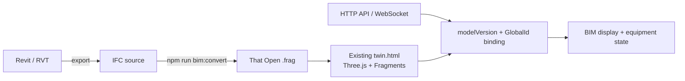

# IFC → That Open Fragments

## Decision

- IFC is the open BIM source and semantic layer.
- That Open Fragments is the browser runtime format.
- Three.js remains the rendering foundation.
- xeokit is not part of this project.
- Device bindings use `modelVersion + GlobalId`.

## Runtime path



## Local workflow

1. Export the coordinated Revit model to `models/ifc/ZN1001.ifc`.
2. Convert it:

   ```powershell
   npm run bim:convert -- .\models\ifc\ZN1001.ifc .\web\public\models\fragments\ZN1001.frag
   ```

3. Run `npm run dev`.
4. Open the unchanged room-view framework at `http://127.0.0.1:5173/twin.html`.

The room-view entry loads IFC/Fragments by default and retains the existing HTML, styles, sidebar, device cards, camera controls, status simulation, and spatial-marker behavior.

## Large-model rules

- Convert IFC before deployment; do not parse large IFC files on every page load.
- Split federation models by building, discipline, or floor when a single runtime file becomes too large.
- Preserve IFC `GlobalId` values during export and model revisions.
- Query properties on demand rather than expanding every property set at startup.
- Keep the Fragments worker self-hosted in the Vite build.
- Benchmark first-visible time, peak memory, navigation FPS, selection latency, and property-query latency with the real project model.

## Current model

The runtime federates the formal `Lab archi.ifc`, `Lab mep.ifc`, and `Sensor.ifc` exports as independent Architecture, MEP, and Sensor Fragments layers. All three are visible by default and can be toggled independently. Non-MEP `IFCCOVERING` elements exported inside the MEP file are hidden at runtime so its ceiling platform does not duplicate the Architecture layer. Equipment discovery currently uses the MEP layer; production telemetry bindings should use stable IFC `GlobalId` values from the owning layer.
